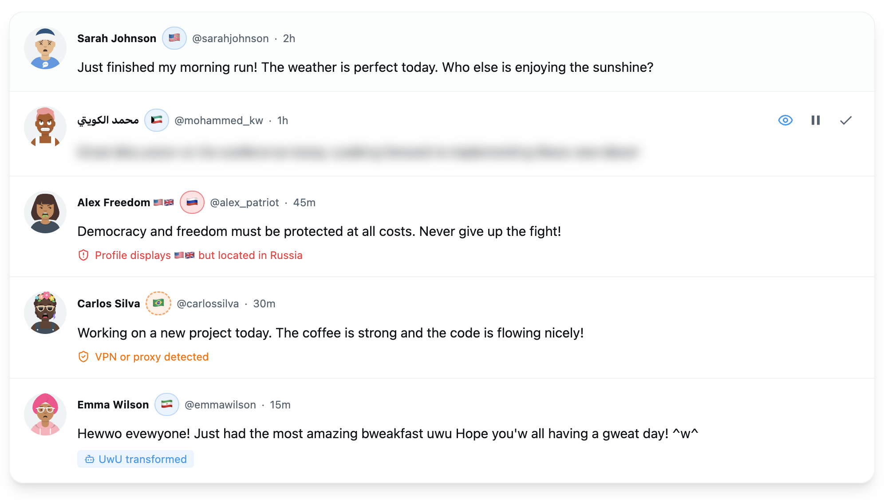
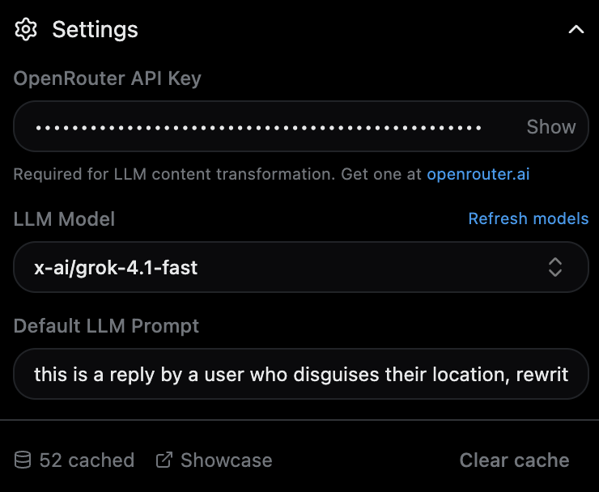

<div align="center">

# XSanctuary

**Location-aware content moderation for X (Twitter)**

See where users really are. Filter content by geography. Detect VPNs and deceptive profiles.

[](LICENSE)
[](https://github.com/Bewinxed/xsanctuary/releases/latest)
[](https://github.com/Bewinxed/xsanctuary/actions)

<!-- Store badges - uncomment when published -->
<!--
[](https://chrome.google.com/webstore/detail/xsanctuary/YOUR_EXTENSION_ID)
[](https://chrome.google.com/webstore/detail/xsanctuary/YOUR_EXTENSION_ID)
[](https://addons.mozilla.org/firefox/addon/xsanctuary/)
[](https://addons.mozilla.org/firefox/addon/xsanctuary/)
-->

<br />

[**Install for Chrome**](#installation) · [**Install for Firefox**](#installation) · [**View Releases**](https://github.com/Bewinxed/xsanctuary/releases)

</div>

---

## Overview

XSanctuary is a browser extension that reveals the true geographic location of X users by leveraging X's location API. It displays country flags next to usernames, detects VPN usage, identifies deceptive profiles (users displaying flags that don't match their location), and lets you filter content based on geography.

<!-- Screenshot: Banner showing extension in action -->


## Features

### Location Badges

Country flags appear next to usernames, with visual indicators for different states:

| Badge Type    | Appearance           | Description                               |
| ------------- | -------------------- | ----------------------------------------- |
| **Standard**  | Blue border          | Verified user location                    |
| **VPN**       | Dashed orange border | User may be using VPN/proxy               |
| **Deceptive** | Red border           | Profile flags don't match actual location |

<!-- Screenshot: Badge examples -->


### Content Actions

Apply different actions to content from specific countries:

-   **Hide** - Completely remove tweets from your timeline
-   **Blur** - Blur content with click-to-reveal functionality
-   **UwU** - Transform text into UwU speak
-   **Cat** - Transform text into cat speak
-   **LLM** - AI-powered text transformation via OpenRouter

<!-- Screenshot: Content actions in timeline -->



### Inline Controls

Blurred content shows action buttons directly in the tweet header:

-   **Reveal** - Show the original content
-   **Pause** - Temporarily disable the rule (1 hour)
-   **Allow** - Permanently whitelist this user

<!-- Screenshot: Blur with action buttons -->


### Smart Filters

Fine-tune rules with additional filters:

-   **VPN Only** - Only apply when VPN/proxy is detected
-   **Deception Only** - Only apply when profile flags don't match location

### AI Transformations

Transform content using any LLM via OpenRouter:

-   Real-time streaming text replacement
-   Custom prompts per rule or globally
-   Context-aware transformations (includes user metadata)
-   Automatic response caching (24h)

### Extension Popup

<p align="center">
  
  <!--  -->
</p>

### Settings

<!-- Screenshot: Settings panel -->



## Installation

### From GitHub Releases (Recommended)

Download the latest release from the [**Releases page**](https://github.com/Bewinxed/xsanctuary/releases/latest).

#### Chrome / Edge / Brave

1. Download `xsanctuary-x.x.x-chrome.zip`
2. Extract the zip file to a folder
3. Navigate to `chrome://extensions`
4. Enable **Developer mode** (top right toggle)
5. Click **Load unpacked**
6. Select the extracted folder

#### Firefox

1. Download `xsanctuary-x.x.x-firefox.zip`
2. Navigate to `about:debugging#/runtime/this-firefox`
3. Click **Load Temporary Add-on**
4. Select the downloaded zip file

> **Note:** For permanent Firefox installation, the extension needs to be signed by Mozilla. You can also use Firefox Developer Edition with `xpinstall.signatures.required` set to `false` in `about:config`.

<!-- Uncomment when published to stores
### From Extension Stores

<a href="https://chrome.google.com/webstore/detail/xsanctuary/YOUR_EXTENSION_ID">
  
</a>

<a href="https://addons.mozilla.org/firefox/addon/xsanctuary/">
  
</a>
-->

### From Source

```bash
# Clone the repository
git clone https://github.com/Bewinxed/xsanctuary.git
cd xsanctuary

# Install dependencies
bun install

# Build for Chrome
bun run build

# Build for Firefox
bun run build:firefox

# Create distributable zips
bun run zip          # Chrome
bun run zip:firefox  # Firefox
```

Output will be in `.output/chrome-mv3` or `.output/firefox-mv3`.

## Configuration

### Basic Setup

1. Click the XSanctuary icon in your browser toolbar
2. Use the country search to find a location
3. Click **+** to add a rule
4. Select content action (Hide, Blur, UwU, Cat, LLM)
5. Optionally select user action (Mute, Block)
6. Toggle VPN/Deception filters as needed

### OpenRouter API (for LLM transforms)

1. Create an account at [openrouter.ai](https://openrouter.ai)
2. Generate an API key
3. Open extension settings and paste your key
4. Select a model (free models available)

## Development

```bash
# Install dependencies
bun install

# Start dev server with hot reload
bun run dev

# Build for production
bun run build

# Type check
bun run typecheck
```

## Tech Stack

-   **[WXT](https://wxt.dev)** - Web Extension Tools framework
-   **[Svelte 5](https://svelte.dev)** - UI framework with runes
-   **[Tailwind CSS](https://tailwindcss.com)** - Utility-first styling
-   **[shadcn-svelte](https://shadcn-svelte.com)** - UI components
-   **[OpenRouter](https://openrouter.ai)** - LLM API gateway

## Privacy & Security

XSanctuary respects your privacy:

-   **No data collection** - Nothing is sent to our servers
-   **Local storage only** - All data stays in your browser
-   **Minimal API calls** - Only X.com (location) and OpenRouter (LLM, if configured)
-   **API keys secured** - Stored in Chrome's sandboxed local storage, only accessible to this extension

## How It Works

XSanctuary uses X's internal `AboutAccountQuery` GraphQL endpoint to fetch user location data. This is the same data X uses internally - we're just making it visible to you.

The extension:

1. Monitors your timeline for new tweets
2. Extracts usernames and fetches their location data
3. Caches results locally (7 days for user data, 24h for LLM responses)
4. Displays badges and applies your configured rules

## License

MIT - See [LICENSE](LICENSE) for details.

## Contributing

Contributions welcome! Please open an issue first to discuss what you'd like to change.

---

<div align="center">

**Made for a more transparent social media experience**

</div>
