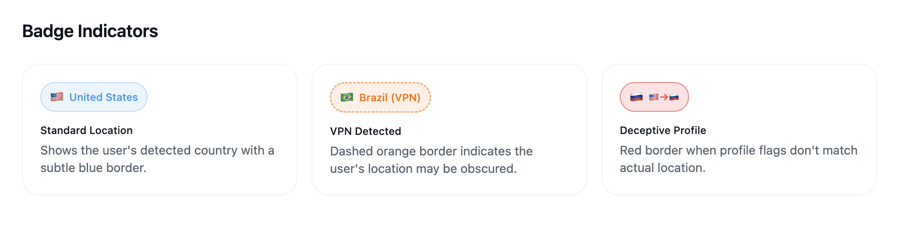
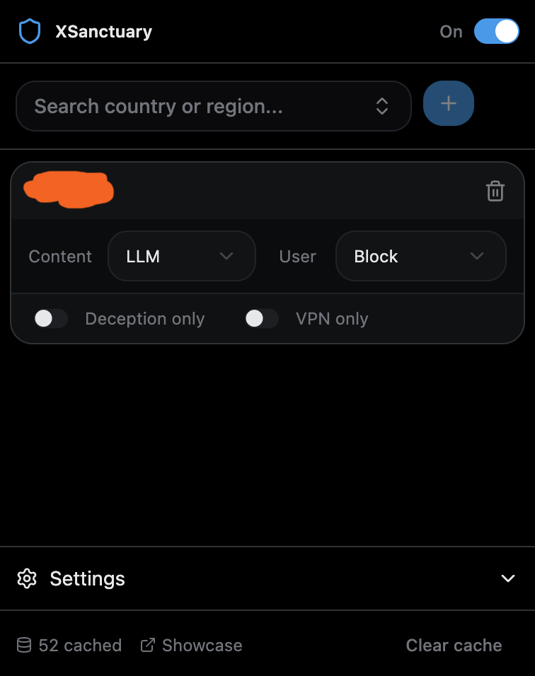

<div align="center">

# XSanctuary

**The ultimate X (Twitter) enhancement extension**

Location-aware moderation. Real-time comic translation. AI-powered content transformation.

[](LICENSE)
[](https://github.com/Bewinxed/xsanctuary/releases/latest)
[](https://github.com/Bewinxed/xsanctuary/actions)

<br />

[**Install for Chrome**](#installation) · [**Install for Firefox**](#installation) · [**View Releases**](https://github.com/Bewinxed/xsanctuary/releases)

</div>

---

## What is XSanctuary?

XSanctuary is a powerful browser extension that enhances your X (Twitter) experience with two major feature sets:

1. **Location Intelligence** - See where users really are, detect VPNs, identify deceptive profiles, and filter content by geography
2. **Comic Translation** - Automatically detect and translate speech bubbles in manga, comics, and webtoons directly in your timeline


---

## Features

### Comic & Manga Translation

Translate comics, manga, and webtoons directly in your Twitter timeline using AI-powered OCR and translation.

#### How It Works

1. **YOLO Detection** - On-device ML model (`yolov8m_seg-speech-bubble`) detects speech bubbles in images
2. **Smart Cropping** - Each bubble is extracted with its exact shape (segmentation mask)
3. **Vision LLM Translation** - Bubbles are sent to a vision-capable LLM for OCR + translation
4. **Overlay Display** - Translations appear as styled overlays matching the original bubble shape

#### Translation Modes

| Mode | Description |
|------|-------------|
| **Bubble Mode** | Hover over detected bubbles to see translations. Original image stays intact. |
| **Auto Mode** | Full image re-rendering with translated text (requires image-generation model) |

#### Key Features

- **On-device detection** - YOLO runs locally in your browser using ONNX Runtime (WebAssembly)
- **Streaming translations** - See text appear character-by-character as the LLM responds
- **Shape-aware overlays** - Bubbles can use the actual detected mask shape, not just ellipses
- **Color matching** - LLM detects original text/background colors and applies them to translations
- **Automatic caching** - Translations are cached to avoid re-processing the same images
- **Lightbox support** - Works in both timeline view and full-screen image viewer
- **Configurable confidence** - Adjust detection sensitivity (0.1 - 1.0)

#### Supported Languages

Translates from Japanese, Korean, Chinese, and other languages to:
English, Spanish, French, German, Italian, Portuguese, Russian, Arabic, Thai, Vietnamese, Indonesian, and more.

---

### Location Intelligence

Reveal the true geographic location of X users by leveraging X's location API.

#### Location Badges

Country flags appear next to usernames with visual indicators:

| Badge Type | Appearance | Description |
|------------|------------|-------------|
| **Standard** | Blue border | Verified user location |
| **VPN** | Dashed orange border | User may be using VPN/proxy |
| **Deceptive** | Red border | Profile flags don't match actual location |



#### Content Actions

Apply different actions to content from specific countries:

| Action | Effect |
|--------|--------|
| **Hide** | Completely remove tweets from your timeline |
| **Blur** | Blur content with click-to-reveal functionality |
| **UwU** | Transform text into UwU speak |
| **Cat** | Transform text into cat speak (nya~) |
| **LLM** | AI-powered text transformation via OpenRouter |

#### User Actions

Automatically apply account-level actions:

| Action | Effect |
|--------|--------|
| **Mute** | Auto-mute users from selected countries |
| **Block** | Auto-block users from selected countries |

#### Smart Filters

Fine-tune when rules apply:

- **VPN Only** - Only trigger when VPN/proxy is detected
- **Deception Only** - Only trigger when profile flags don't match actual location

#### Inline Controls

Blurred content shows action buttons directly in the tweet header:

- **Reveal** - Show the original content
- **Pause 1h** - Temporarily disable the rule
- **Allow** - Permanently whitelist this user


---

### AI Text Transformation

Transform tweet content using any LLM via OpenRouter:

- **Real-time streaming** - See text appear as the LLM generates it
- **Custom prompts** - Set global or per-country transformation prompts
- **Context-aware** - Transformations include user metadata (country, VPN status, deception info)
- **Automatic caching** - Responses cached for 24 hours
- **100+ models** - Access GPT-4, Claude, Gemini, Llama, and more through OpenRouter

---

## Extension Popup

<p align="center">
  
</p>

The popup provides quick access to:

- **Enable/disable toggle** - Turn the extension on/off
- **Country rules** - Add, edit, and remove location-based rules
- **Comic translation settings** - Configure bubble detection and translation
- **API key management** - Set your OpenRouter API key
- **Model selection** - Choose LLM models for text and vision tasks
- **Theme toggle** - Light, dark, or system theme

---

## Installation

### From GitHub Releases (Recommended)

Download the latest release from the [**Releases page**](https://github.com/Bewinxed/xsanctuary/releases/latest).

#### Chrome / Edge / Brave

1. Download `xsanctuary-x.x.x-chrome.zip`
2. Extract the zip file to a folder
3. Navigate to `chrome://extensions`
4. Enable **Developer mode** (top right toggle)
5. Click **Load unpacked**
6. Select the extracted folder

#### Firefox

1. Download `xsanctuary-x.x.x-firefox.zip`
2. Navigate to `about:debugging#/runtime/this-firefox`
3. Click **Load Temporary Add-on**
4. Select the downloaded zip file

> **Note:** For permanent Firefox installation, the extension needs to be signed by Mozilla.

### From Source

```bash
# Clone the repository
git clone https://github.com/Bewinxed/xsanctuary.git
cd xsanctuary

# Install dependencies
bun install

# Build for Chrome
bun run build

# Build for Firefox
bun run build:firefox

# Create distributable zips
bun run zip          # Chrome
bun run zip:firefox  # Firefox
```

---

## Configuration

### Quick Start

1. Click the XSanctuary icon in your browser toolbar
2. Add your OpenRouter API key (required for translations and LLM transforms)
3. Enable Comic Translation if desired
4. Add country rules for location-based filtering

### Comic Translation Setup

1. **Enable** - Toggle on "Comic Translation" in the popup
2. **API Key** - Add your OpenRouter API key (get one free at [openrouter.ai](https://openrouter.ai))
3. **Model** - Select a vision-capable model (default: Gemini 2.5 Flash)
4. **Language** - Choose your target translation language
5. **Trigger Mode** - Button (click to translate) or Auto (translate on load)
6. **Bubble Shape** - Ellipse (simple oval) or Mask (actual detected shape)
7. **Confidence** - Detection sensitivity (lower = more bubbles detected)

### Location Rules Setup

1. Use the country search to find a location
2. Click **+** to add a rule
3. Select content action (Hide, Blur, UwU, Cat, LLM)
4. Optionally select user action (Mute, Block)
5. Toggle VPN/Deception filters as needed
6. Set custom LLM prompt if using AI transformation

---

## Tech Stack

- **[WXT](https://wxt.dev)** - Web Extension Tools framework
- **[Svelte 5](https://svelte.dev)** - UI framework with runes
- **[Tailwind CSS](https://tailwindcss.com)** - Utility-first styling
- **[shadcn-svelte](https://shadcn-svelte.com)** - UI components
- **[ONNX Runtime](https://onnxruntime.ai)** - On-device ML inference (WebAssembly)
- **[YOLOv8](https://ultralytics.com)** - Speech bubble detection model
- **[OpenRouter](https://openrouter.ai)** - LLM API gateway

---

## Privacy & Security

XSanctuary respects your privacy:

- **No data collection** - Nothing is sent to our servers
- **Local ML inference** - YOLO detection runs entirely in your browser
- **Local storage only** - All settings and caches stay in your browser
- **Minimal API calls** - Only X.com (location) and OpenRouter (LLM/vision, if configured)
- **API keys secured** - Stored in Chrome's sandboxed local storage

### What Data Goes Where

| Data | Destination |
|------|-------------|
| User location lookups | X.com (Twitter's own API) |
| Bubble images for translation | OpenRouter (your configured model) |
| LLM text transformations | OpenRouter (your configured model) |
| Detection model inference | Local (your browser) |
| Settings & caches | Local (browser storage) |

---

## How It Works

### Location Intelligence

XSanctuary uses X's internal `AboutAccountQuery` GraphQL endpoint to fetch user location data. This is the same data X uses internally - we're just making it visible to you.

The extension:
1. Monitors your timeline for new tweets
2. Extracts usernames and fetches their location data
3. Caches results locally (7 days for user data, 24h for LLM responses)
4. Displays badges and applies your configured rules

### Comic Translation

The comic translation pipeline:
1. **Detection** - When you click the translate button (or automatically), the image is sent to an offscreen document
2. **YOLO Inference** - The YOLOv8 segmentation model runs on the image, detecting speech bubbles with bounding boxes and segmentation masks
3. **Mask Processing** - Segmentation masks are converted to CSS `polygon()` paths for accurate bubble shapes
4. **Bubble Cropping** - Each detected bubble is cropped from the original image with padding
5. **Vision LLM** - Cropped bubbles are sent to a vision-capable LLM (via OpenRouter) for OCR and translation
6. **Overlay Rendering** - Translated text is displayed in styled overlays that match the original bubble shape and colors

---

## Development

```bash
# Install dependencies
bun install

# Start dev server with hot reload
bun run dev

# Build for production
bun run build

# Type check
bun run check
```

---

## License

MIT - See [LICENSE](LICENSE) for details.

## Contributing

Contributions welcome! Please open an issue first to discuss what you'd like to change.

---

<div align="center">

**Made for a more transparent and accessible social media experience**

[Report Bug](https://github.com/Bewinxed/xsanctuary/issues) · [Request Feature](https://github.com/Bewinxed/xsanctuary/issues)

</div>
