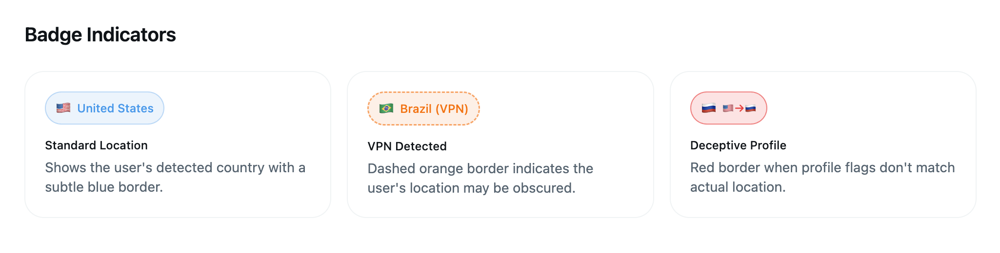
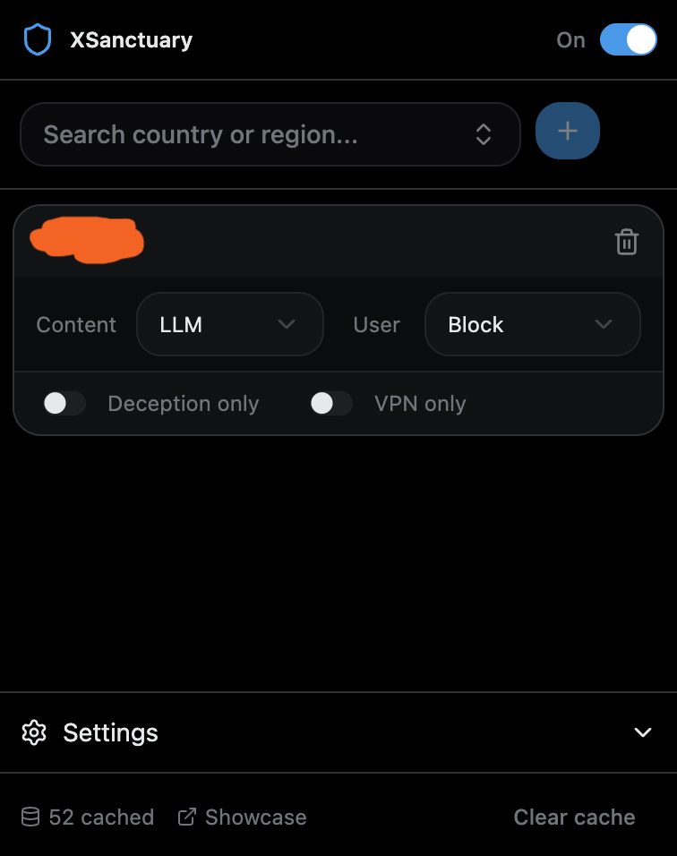

<div align="center">

# XSanctuary

A browser extension for X (Twitter) that shows where accounts are based, translates comics in your timeline, and downloads videos.

[](LICENSE)
[](https://github.com/Bewinxed/xsanctuary/releases/latest)
[](https://github.com/Bewinxed/xsanctuary/actions)

<br />

[**Install for Chrome**](#installation) · [**Install for Firefox**](#installation) · [**View Releases**](https://github.com/Bewinxed/xsanctuary/releases)

</div>

---

## What is XSanctuary?

XSanctuary adds three things to X:

1. Location data on accounts, so you can see where someone is actually posting from, spot VPN use, and filter your timeline by country
2. Comic translation, which detects speech bubbles in images and translates them in place
3. Video and audio downloads, with a format picker on every video and GIF


---

## Features

### Video and audio downloads

Hover any video or GIF in your timeline and a download button appears in the corner. Click it (or right-click the player) to get a menu of everything X is actually serving for that clip.

The menu lists every resolution X has, with bitrate and an estimated file size, so you can grab the 1080p copy or the small one depending on what you need. Below that are audio options, which pull the soundtrack out of the video without downloading a video file you'd only throw away.

| Audio format | What it does |
|--------------|--------------|
| M4A | Copies the original AAC track. No re-encoding, so it's lossless and near instant. |
| MP3 | 192 kbps, encoded locally with LAME. |
| Opus | 128 kbps. Smallest file for the same quality. |
| WAV | Uncompressed. Large files. |

Some videos, mostly long ones and broadcasts, are only served as adaptive HLS streams with no plain MP4 to grab. Those get a "best available" option that pulls the stream down and remuxes it into an MP4 locally.

Everything happens in your browser. No download service, no upload, no third party sees which videos you save.

#### How it finds the formats

X hands the `<video>` element a `blob:` URL, so the page itself gives away nothing about the real files. The format list has to come from X's own API responses.

Rather than replicating X's GraphQL query IDs, which rotate constantly and break every few weeks, XSanctuary reads the responses the page is already fetching. A small script runs in the page's own JavaScript context, watches `fetch` and `XMLHttpRequest`, and picks the variant URLs out of any response that contains video metadata. Nothing extra is requested, and there's nothing to keep updated when X changes its query IDs.

Conversion runs in an offscreen document using [mediabunny](https://mediabunny.dev), which reads and writes media formats in pure TypeScript with no server round trip.

> **Chrome only.** This feature needs a content script running in the page's main world, which requires Manifest V3. The Firefox build is MV2, so the download button doesn't appear there.

---

### Comic and manga translation

Translates comics, manga, and webtoons in your timeline using on-device detection and a vision model for the text.

#### How it works

1. A YOLO model (`yolov8m_seg-speech-bubble`) runs locally and finds speech bubbles in the image
2. Each bubble is cropped using its segmentation mask, so the crop follows the actual bubble shape
3. The crop goes to a vision-capable LLM for OCR and translation
4. The translation is drawn back over the original bubble

#### Translation modes

| Mode | Description |
|------|-------------|
| Bubble | Hover a detected bubble to see its translation. The original image is untouched. |
| Auto | Re-renders the whole image with translated text. Needs an image-generation model. |

Detection runs locally through ONNX Runtime on WebAssembly, so images are never uploaded for that step. Translations stream in character by character as the model responds, and get cached so the same image isn't processed twice. Overlays can follow the detected mask shape rather than a plain ellipse, and pick up the original text and background colors. It works in the timeline and in the full-screen image viewer. Detection sensitivity is adjustable from 0.1 to 1.0.

#### Supported languages

Translates from Japanese, Korean, Chinese and others into English, Spanish, French, German, Italian, Portuguese, Russian, Arabic, Thai, Vietnamese, Indonesian, and more.

---

### Location intelligence

Shows where X users are actually based, using X's own location API.

#### Location badges

Country flags appear next to usernames:

| Badge type | Appearance | Meaning |
|------------|------------|---------|
| Standard | Blue border | Location as reported by X |
| VPN | Dashed orange border | X flagged the location as inaccurate |
| Deceptive | Red border | Flags in the profile don't match the actual location |



#### Content actions

Per-country rules for what happens to matching tweets:

| Action | Effect |
|--------|--------|
| Hide | Removes the tweet from your timeline |
| Blur | Blurs it, click to reveal |
| UwU | Rewrites the text into UwU speak |
| Cat | Rewrites the text into cat speak (nya~) |
| LLM | Rewrites the text with a model via OpenRouter |

#### User actions

| Action | Effect |
|--------|--------|
| Mute | Auto-mutes accounts from selected countries |
| Block | Auto-blocks accounts from selected countries |

#### Filters

Rules can be narrowed to fire only when a VPN is detected, or only when the profile's flags contradict the reported location.

#### Inline controls

Blurred tweets get buttons in the header to reveal the content, pause the rule for an hour, or whitelist that account permanently.


---

### AI text transformation

Rewrites tweet text through any model on OpenRouter. Text streams in as the model generates it. Prompts can be set globally or per country, and the transformation gets the user's metadata (country, VPN status, deception flags) as context. Responses are cached for 24 hours.

---

## Extension popup

<p align="center">
  
</p>

The popup handles the on/off toggle, country rules, comic translation settings, video download settings, your OpenRouter API key, model selection, and the light/dark/system theme.

---

## Installation

### From GitHub releases

Download the latest build from the [releases page](https://github.com/Bewinxed/xsanctuary/releases/latest).

#### Chrome / Edge / Brave

1. Download `xsanctuary-x.x.x-chrome.zip`
2. Extract it to a folder
3. Go to `chrome://extensions`
4. Turn on **Developer mode** (top right)
5. Click **Load unpacked**
6. Select the extracted folder

#### Firefox

1. Download `xsanctuary-x.x.x-firefox.zip`
2. Go to `about:debugging#/runtime/this-firefox`
3. Click **Load Temporary Add-on**
4. Select the zip

> A permanent Firefox install needs the extension signed by Mozilla. Note that comic translation and video downloads are Chrome only, because both rely on APIs the MV2 Firefox build doesn't have.

### From source

```bash
git clone https://github.com/Bewinxed/xsanctuary.git
cd xsanctuary

bun install

bun run build          # Chrome
bun run build:firefox  # Firefox

bun run zip            # Chrome zip
bun run zip:firefox    # Firefox zip
```

---

## Configuration

### Quick start

1. Click the XSanctuary icon in your toolbar
2. Add your OpenRouter API key if you want translations or LLM rewrites
3. Turn on comic translation if you want it
4. Add country rules

Video downloads work out of the box and need no API key.

### Comic translation setup

Toggle it on in the popup, add an OpenRouter key ([free tier available](https://openrouter.ai)), and pick a vision-capable model. Gemini 2.5 Flash is the default. Then set your target language, whether translation triggers on a button click or automatically on load, whether overlays use a plain ellipse or the detected mask shape, and the detection confidence. Lower confidence finds more bubbles.

### Video download setup

Open the Video Downloads section in the popup. You can turn the hover button off, disable the right-click menu if it clashes with how you use X, and set which audio format is listed first.

### Location rules setup

Search for a country, click **+** to add a rule, then pick a content action and optionally a user action. Toggle the VPN and deception filters if you want the rule narrowed, and set a custom prompt if you chose the LLM action.

---

## Tech stack

- [WXT](https://wxt.dev) for the extension build
- [Svelte 5](https://svelte.dev) with runes
- [Tailwind CSS](https://tailwindcss.com) and [shadcn-svelte](https://shadcn-svelte.com)
- [mediabunny](https://mediabunny.dev) for reading and converting media in the browser
- [ONNX Runtime](https://onnxruntime.ai) on WebAssembly for local inference
- [YOLOv8](https://ultralytics.com) for speech bubble detection
- [OpenRouter](https://openrouter.ai) as the LLM gateway

---

## Privacy

Nothing is collected and nothing goes to a server run by this project.

| Data | Where it goes |
|------|---------------|
| User location lookups | X.com, using Twitter's own API |
| Video and audio downloads | Straight from X's CDN to your disk. Conversion is local. |
| Bubble images for translation | OpenRouter, to the model you configured |
| LLM text rewrites | OpenRouter, to the model you configured |
| Bubble detection | Local, in your browser |
| Settings and caches | Local browser storage |

Your API key is kept in the browser's sandboxed local storage.

---

## How it works

### Location intelligence

The extension calls X's internal `AboutAccountQuery` GraphQL endpoint for account location data. It's the same data X uses itself. The extension watches your timeline for new tweets, looks up the accounts it hasn't seen, caches the results for seven days (24 hours for LLM responses), and applies your rules.

### Comic translation

Images go to an offscreen document, where the YOLOv8 segmentation model finds bubbles and returns boxes plus masks. Masks become CSS `polygon()` paths so the overlay matches the bubble outline. Each bubble is cropped with padding and sent to a vision model through OpenRouter for OCR and translation, then rendered back over the original with matching colors.

### Video downloads

Covered in detail [above](#how-it-finds-the-formats). In short: a main-world script reads X's API responses as the page fetches them and collects the variant list, the content script builds the format menu, and the offscreen document handles conversion through mediabunny before handing the file to Chrome's download manager.

---

## Changelog

### 1.1.0

Added video and audio downloads. Every video and GIF gets a hover button and a right-click menu listing X's real formats: each MP4 resolution with its bitrate and estimated size, plus audio-only export to M4A, MP3, Opus, or WAV.

This was worth building now because of two things that landed in [mediabunny](https://mediabunny.dev) recently. Version 1.42.0 (April 2026) added read and write support for HLS, which is what makes the adaptive-stream videos downloadable at all. Before that you'd have had to parse playlists and stitch segments by hand. Separately, the [@mediabunny/mp3-encoder](https://www.npmjs.com/package/@mediabunny/mp3-encoder) package ships a WASM build of LAME, which fills the gap left by browsers shipping no MP3 encoder in WebCodecs. MP3 export would otherwise have had to be greyed out.

The extension now requests the `downloads` permission. Video downloads are Chrome only.

---

## Development

```bash
bun install
bun run dev     # dev server with hot reload
bun run build   # production build
bun run check   # type check
```

---

## License

MIT. See [LICENSE](LICENSE).

## Contributing

Contributions welcome. Please open an issue first so we can talk about the change before you write it.

---

<div align="center">

[Report a bug](https://github.com/Bewinxed/xsanctuary/issues) · [Request a feature](https://github.com/Bewinxed/xsanctuary/issues)

</div>
